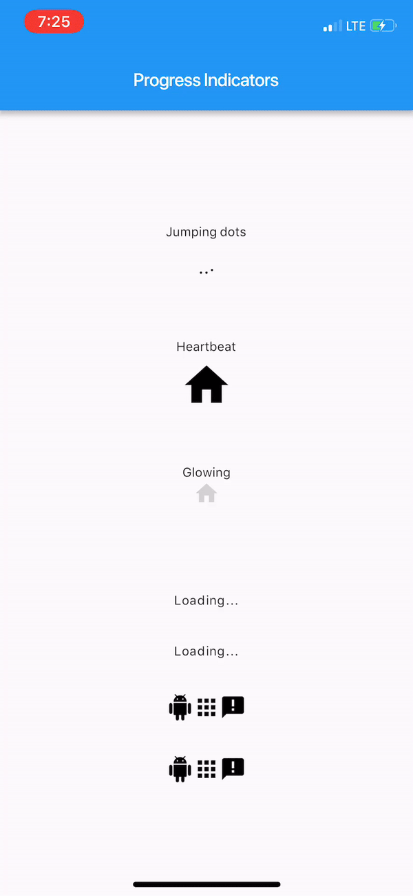

# Flutter progress indicators

With this project, we are aiming to provide some cool, animated progress indicators to Flutter developers. 

# Currently available
## Sample
Here's how it looks like.



## Usage
Import `package:progress_indicators/progress_indicators.dart` and use these avaiable widgets:
* `FadingText` 
* `JumpingText`
* `ScalingText`
* `JumpingDots`
* `HeartbeatProgressIndicator`
* `GlowingProgressIndicator`
* `CollectionSlideTranstion`
* `CollectionScaleTransition` 

## Example
```
Widget build(BuildContext context) {
    print(Offset(0.0, -1.0).distanceSquared - Offset(0.0, 0.0).distanceSquared);
    return new Scaffold(
      appBar: new AppBar(
        title: new Text(widget.title),
      ),
      body: new Center(
        child: new Column(
          mainAxisAlignment: MainAxisAlignment.center,
          children: <Widget>[
            new Text('Jumping dots'),
            JumpingDotsProgressIndicator(
              fontSize: 20.0,
            ),
            SizedBox(height: 60.0),
            new Text('Heartbeat'),
            SizedBox(height: 16.0),
            HeartbeatProgressIndicator(
              child: Icon(Icons.home),
            ),
            SizedBox(height: 60.0),
            new Text('Glowing'),
            GlowingProgressIndicator(
              child: Icon(Icons.home),
            ),
            SizedBox(height: 32.0),
            FadingText('Loading...'),
            SizedBox(height: 32.0),
            JumpingText('Loading...'),
            SizedBox(height: 32.0),
            ScalingText('Loading...'),
            SizedBox(height: 32.0),
            CollectionSlideTransition(
              children: <Widget>[
                Icon(Icons.android),
                Icon(Icons.apps),
                Icon(Icons.announcement),
              ],
            ),
            SizedBox(height: 32.0),
            CollectionScaleTransition(
              children: <Widget>[
                Icon(Icons.android),
                Icon(Icons.apps),
                Icon(Icons.announcement),
              ],
            ),
          ],
        ),
      ),
    );
  }
```

For complete sample, see the [this example app](https://github.com/wal33d006/progress_indicators/tree/master/example).